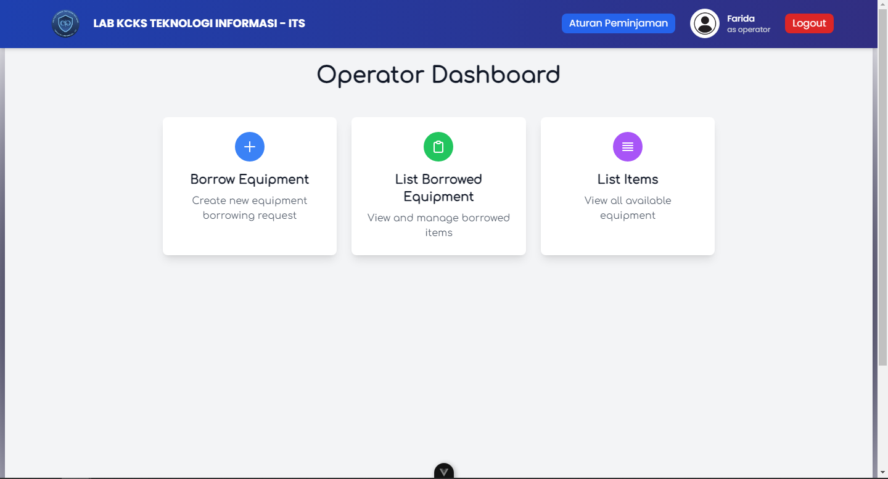

# pweb-fp-P02-2024

# Praktikum Pemrograman Web Kelompok P02 2024

**KELOMPOK P02**
| Nama | NRP |
|---------------------------|------------|
|Aisyah Rahmasari | 5027231072 |
|Michael Kenneth Salim | 5027231008 |
|Azza Farichi Tjahjono | 5027231071 |

<hr>

## **Project Overview**

This project is our last project for our Web Development course in 2024. The goal of this project is to develop a web application that can help LAB KCKS monitor the items borrowed by students. In this system, students cannot borrow items directly, but they must borrow through a lab operator.

## **Data Models**
```bash
enum Role {
	'USER',
	'ADMIN'
}

type User = {
	username: string;
	password: string;
	role: Role;
}

type Items = {
    pic: string;
	name: string;
	amount: string;
	condition: string;
	created_at: Date;
}

type BorrowItems = {
	item_name: string;
	amount: string;
	borrow_date: Date;
	return_date: Date;
	borrower_name: string;
	officer_name: string;
}

type Operators = {
    image: string;
    name: string;
    age: string;
    NoTelp: string;
    Email: string;
}
```

## **Main Features**
### **Home**
| Section Name              | Path     | Description                                                                                           |
|---------------------------|----------|-------------------------------------------------------------------------------------------------------|
| Landing (authentication)  | `/`      | Login form with dummy data in the database (no registration feature). Login tokens are stored in local storage. |
| Navbar and Footer          | `-`      | Displays the name of the logged-in user on the navbar.                                               |
| Borrowing Rules & Flow     | `/#rules`| Static page describing the rules and borrowing process (hardcoded content).                          |

### **Admin Dashboard**
| Section Name    | Path                | Description                                                                                                  |
|------------------|---------------------|--------------------------------------------------------------------------------------------------------------|
| Items Data       | `/admin`           | Displays a list of all items. Admins can add, edit, or delete items by their ID.                             |
| Operators Data   | `/admin/all-operator` | Displays a list of operators. Admins can add, edit, or delete operator data by their ID.                     |
| Borrowing Summary | `/admin/summary`   | Displays a table summarizing borrowed items with columns: No, Item Name, Borrowed Amount, Borrow Date, Return Date, Borrower, Officer. <br> Includes a feature to export data as a PDF (with options to filter by date, borrower, etc.). |

### **Operator Dashboard**
| Section Name     | Path                       | Description                                                                                           |
|-------------------|----------------------------|-------------------------------------------------------------------------------------------------------|
| Borrowing Form    | `/operator/book-equipment` | Form to record item borrowing with inputs: Item Name, Borrowed Amount, Return Date, Borrower Name, Officer Name. |
| Items Data        | `/operator/all-equipment` | Displays a table of available items with columns: No, Item Name, Condition, Quantity, Registration Date. |
| Borrowing Data    | `/operator/all-equipment` | Displays a table of borrowed items with columns: No, Item Name, Borrowed Amount, Borrow Date, Return Date, Borrower, Officer. <br> Includes a feature to filter and sort columns (ascending/descending). |

## Technologies Used

- **Frontend**: HTML, CSS, TypeScript, Vue.js
- **Backend**: Node.js, Express.js
- **Database**: MongoDB
- **Version Control**: Git, GitHub

## Installation

1. Clone the repository:
    ```bash
    git clone https://github.com/KenetHilang/pweb-fp-P02-2024.git
    ```
2. Navigate to the project directory:
    ```bash
    cd pweb-fp-P02-2024
    ```

### BackEnd

3. Navigate to the BackEnd directory:
    ```bash
    cd server
    ```
4. Install dependencies:
    ```bash
    npm install
    ```
5. Set up the database and configure environment variables.
    ```bash
    MONGODB_URI=mongodb+srv://[username]:[pw]@[cluster-name]/[db-name]?retryWrites=true&w=majority&appName=[]
    JWT_SECRET=(....)
    PORT=5000
    ```
6. Start the development server:
    ```bash
    npm run start:dev
    ```
    
### FrontEnd

3. Navigate to the FrontEnd directory:
    ```bash
    cd client
    ```
4. Install dependencies:
    ```bash
    npm install
    ```
5. Start the development server:
    ```bash
    npm run dev 
    ```

## Usage

- Open your browser and navigate to `http://localhost:5173` to view the application.
- Register for a new account or log in with existing credentials.
- Explore the features and functionalities of the web application.

## Documentation

### **Home Page**


### **Admin Page**

#### **/admin**


#### **/admin/all-operator**


#### **/admin/summary**


### **Operator Page**

#### **/HomePageOperator**


#### **/operator/book-equipment**


#### **/operator/all-equipment**


#### **/operator/borrowed-items**
